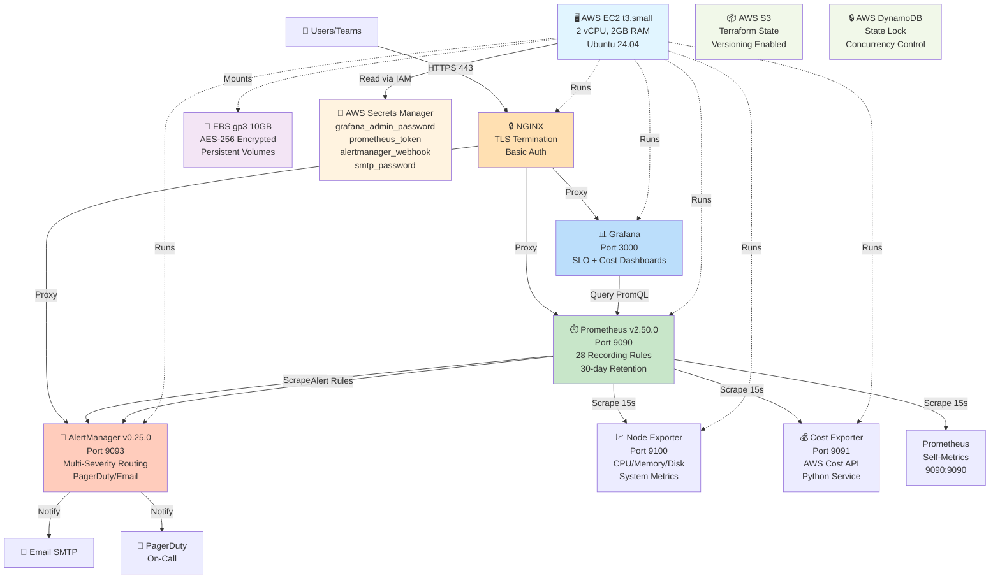

````markdown
# Architecture Diagrams & System Design

## 1. Full System Architecture


```mermaid
graph TB
  Users["👥 Users/Teams"]
  
  Users -->|HTTPS 443| NGINX["🔒 NGINX<br/>TLS Termination<br/>Basic Auth"]
  
  NGINX -->|Proxy| Grafana["📊 Grafana<br/>Port 3000<br/>SLO + Cost Dashboards"]
  NGINX -->|Proxy| Prometheus["⏱️ Prometheus v2.50.0<br/>Port 9090<br/>28 Recording Rules<br/>30-day Retention"]
  NGINX -->|Proxy| Alertmanager["🚨 AlertManager v0.25.0<br/>Port 9093<br/>Multi-Severity Routing<br/>PagerDuty/Email"]
  
  Prometheus -->|Scrape 15s| NodeExporter["📈 Node Exporter<br/>Port 9100<br/>CPU/Memory/Disk<br/>System Metrics"]
  Prometheus -->|Scrape 15s| CostExporter["💰 Cost Exporter<br/>Port 9091<br/>AWS Cost API<br/>Python Service"]
  Prometheus -->|Scrape 15s| PrometheusMetrics["Prometheus<br/>Self-Metrics<br/>9090:9090"]
  Prometheus -->|Scrape 15s| Alertmanager
  Prometheus -->|Alert Rules| Alertmanager
  
  Grafana -->|Query PromQL| Prometheus
  
  Alertmanager -->|Notify| Email["📧 Email SMTP"]
  Alertmanager -->|Notify| PagerDuty["📱 PagerDuty<br/>On-Call"]
  
  EC2["🖥️ AWS EC2 t3.small<br/>2 vCPU, 2GB RAM<br/>Ubuntu 24.04"]
  
  EC2 -.->|Runs| NGINX
  EC2 -.->|Runs| Prometheus
  EC2 -.->|Runs| Grafana
  EC2 -.->|Runs| Alertmanager
  EC2 -.->|Runs| NodeExporter
  EC2 -.->|Runs| CostExporter
  
  EBS["💾 EBS gp3 10GB<br/>AES-256 Encrypted<br/>Persistent Volumes"]
  EC2 -.->|Mounts| EBS
  
  SecretsManager["🔐 AWS Secrets Manager<br/>grafana_admin_password<br/>prometheus_token<br/>alertmanager_webhook<br/>smtp_password"]
  EC2 -->|Read via IAM| SecretsManager
  
  S3Backend["📦 AWS S3<br/>Terraform State<br/>Versioning Enabled"]
  DynamoDB["🔒 AWS DynamoDB<br/>State Lock<br/>Concurrency Control"]
  
  style EC2 fill:#e1f5ff
  style EBS fill:#f3e5f5
  style SecretsManager fill:#fff3e0
  style S3Backend fill:#f1f8e9
  style DynamoDB fill:#f1f8e9
  style NGINX fill:#ffe0b2
  style Prometheus fill:#c8e6c9
  style Grafana fill:#bbdefb
  style Alertmanager fill:#ffccbc
```

... (kept same content as docs/ARCHITECTURE.md)

````
