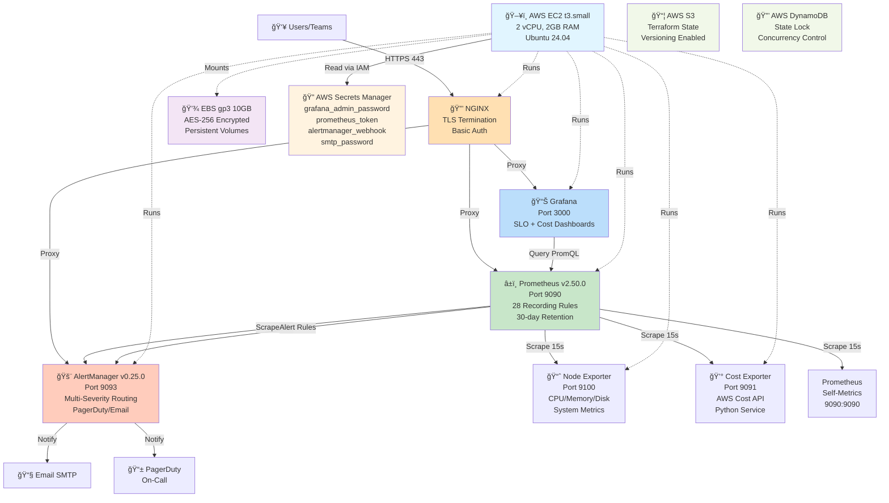
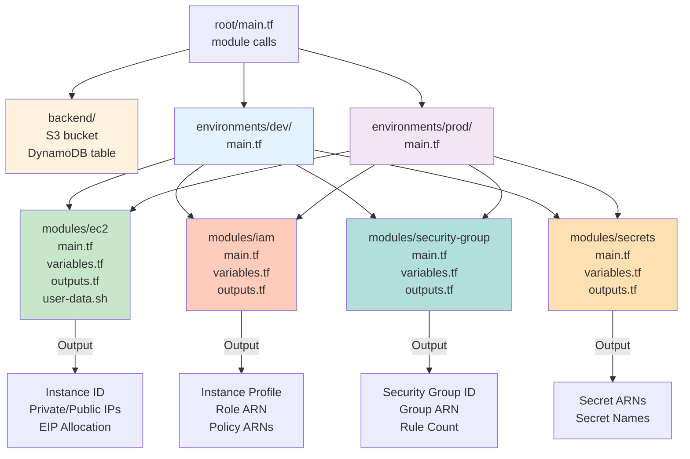

# Architecture Diagrams & System Design

## 1. Full System Architecture



## 2. Simplified Logical View

```mermaid
graph LR
  subgraph "Data Collection"
    NodeExporter
    CostExporter
    PrometheusMetrics["Prometheus Metrics"]
  end
  
  subgraph "Time Series DB"
    Prometheus["🕐 Prometheus<br/>28 Recording Rules<br/>25+ Alert Rules"]
  end
  
  subgraph "Alerting"
    Alertmanager["🚨 Alert Router<br/>Multi-Severity<br/>Multi-Channel"]
  end
  
  subgraph "Visualization"
    Grafana["📊 Grafana<br/>SLO Dashboard<br/>Cost Dashboard"]
  end
  
  subgraph "Access Layer"
    NGINX["🔐 NGINX<br/>TLS + Auth"]
  end
  
  NodeExporter -->|Metrics| Prometheus
  CostExporter -->|Metrics| Prometheus
  PrometheusMetrics -->|Metrics| Prometheus
  
  Prometheus -->|Queries| Grafana
  Prometheus -->|Alert Rules| Alertmanager
  
  Grafana -->|HTTPS| NGINX
  Alertmanager -->|HTTPS| NGINX
  Prometheus -->|HTTPS| NGINX
  
  NGINX -->|HTTPS 443| Users["👥 Users"]
```



## 3. Deployment Architecture (AWS)

```mermaid
graph TB
  subgraph "AWS Account"
    subgraph "VPC/Subnet"
      SG["🔓 Security Group<br/>Port 22: SSH<br/>Port 80/443: HTTP/HTTPS<br/>Port 9090: Prometheus<br/>Port 9091-9100: Metrics<br/>Port 9093: AlertManager"]
      
      EC2Instance["🖥️ EC2 t3.small<br/>Role: EC2-Instance-Profile<br/>6 Containers"]
      
      EBS["💾 EBS gp3 10GB<br/>Encrypted AES-256<br/>/var/lib/prometheus<br/>/var/lib/grafana"]
      
      EIP["🌐 Elastic IP<br/>Prod Only<br/>Static Public IP"]
    end
    
    SecretsManager["🔐 Secrets Manager<br/>4 Encrypted Secrets<br/>Rotatable"]
    
    S3["📦 S3 Backend<br/>terraform.tfstate<br/>Versioning<br/>SSE-S3"]
    
    DynamoDB["🔒 DynamoDB<br/>terraform-lock<br/>Conditional Write"]
    
    CloudWatch["📊 CloudWatch<br/>Optional Detailed<br/>Monitoring"]
  end
  
  GitHub["🐙 GitHub<br/>Actions<br/>CI/CD"]
  
  SG -.->|Restricts| EC2Instance
  EC2Instance -.->|Mounts| EBS
  EC2Instance -.->|Associates| EIP
  EC2Instance -->|Read IAM| SecretsManager
  Terraform -.->|State| S3
  Terraform -.->|Locks| DynamoDB
  GitHub -->|Deploy| Terraform
  GitHub -->|SSH Deploy| EC2Instance
```



## 4. Terraform Module Architecture



## 5. Data Flow: Request → Metrics → Alert

```mermaid
sequenceDiagram
  actor User
  participant NGINX
  participant Prometheus
  participant RecordingRules["Recording Rules<br/>28 Total"]
  participant AlertRules["Alert Rules<br/>25+ Total"]
  participant Alertmanager
  participant Notification["Email/PagerDuty"]
  
  User ->>+ NGINX: HTTPS GET /graph
  NGINX ->>+ Prometheus: Proxy /graph
  Prometheus ->> Prometheus: Query Time-Series DB
  Prometheus -->>- NGINX: JSON Response
  NGINX -->>- User: HTML/Dashboard
  
  Note over Prometheus,AlertRules: Every 15 seconds (scrape)
  Prometheus ->> RecordingRules: Evaluate 28 rules
  RecordingRules ->> Prometheus: Store results (slo:*, burn_rate:*, etc.)
  
  Note over AlertRules,Notification: Every 30 seconds (eval)
  Prometheus ->> AlertRules: Evaluate 25+ alerts
  AlertRules ->> Alertmanager: If breach detected + duration met
  Alertmanager ->> Alertmanager: Route by severity/labels
  Alertmanager ->> Notification: Send alert
  Notification -->> User: 🚨 Critical Alert
```

## 6. Alert Routing Flow

```mermaid
graph TD
  Alert["Alert Fires<br/>e.g., FastBurnAlert<br/>or CostSpike"]
  
  Alertmanager["AlertManager<br/>Multi-Severity Router"]
  
  Alert -->|prometheus_alert| Alertmanager
  
  Alertmanager -->|Severity<br/>CRITICAL| CriticalRoute["Critical Route<br/>group_by: alertname"]
  Alertmanager -->|Severity<br/>WARNING| WarningRoute["Warning Route<br/>group_by: alertname"]
  Alertmanager -->|Severity<br/>INFO| InfoRoute["Info Route<br/>group_by: alertname"]
  
  CriticalRoute -->|Receivers| CriticalReceivers["PagerDuty<br/>Email<br/>Slack*"]
  WarningRoute -->|Receivers| WarningReceivers["Email<br/>Slack*"]
  InfoRoute -->|Receivers| InfoReceivers["Email<br/>Slack*"]
  
  CriticalReceivers -->|Notification| OnCall["📱 On-Call Responder"]
  WarningReceivers -->|Notification| Team["👥 Team Channel"]
  InfoReceivers -->|Notification| Archive["📋 Audit Log"]
  
  OnCall -->|Acknowledge| Alertmanager
  Alertmanager -->|Inhibit| SilenceCritical["Silence lower severity<br/>alerts for same instance"]
  
  style Alert fill:#ffcdd2
  style Alertmanager fill:#ffccbc
  style CriticalRoute fill:#ef5350
  style WarningRoute fill:#ffa726
  style InfoRoute fill:#29b6f6
  style OnCall fill:#66bb6a
  style SilenceCritical fill:#ab47bc
```



---

## Architecture Summary

### Components
- **6 Services**: nginx (proxy), Prometheus (TSDB), Grafana (UI), AlertManager (routing), node-exporter (metrics), cost-exporter (AWS API)
- **AWS Infrastructure**: EC2 t3.small, EBS gp3 10GB encrypted, Secrets Manager (4 secrets), IAM instance profile, S3 backend + DynamoDB locking
- **Monitoring**: 28 recording rules (5m/30m/1h/6h/30d windows), 25+ alert rules (traditional, SLO multi-burn-rate, cost)
- **Dashboards**: SLO Overview (5 panels), Cost Overview (4 panels), both with live PromQL queries

### Data Flow
1. **Collection**: node-exporter, cost-exporter, Prometheus self-metrics (every 15 seconds)
2. **Evaluation**: Recording rules computed (28 rules), alert rules evaluated (25+ rules)
3. **Routing**: AlertManager routes by severity, receivers are email/PagerDuty
4. **Visualization**: Grafana queries Prometheus, displays on dashboards, accessible via NGINX TLS proxy
5. **Access Control**: NGINX basic auth + TLS 1.2+, Secrets Manager for credentials, IAM for AWS API access

### High Availability Considerations
- **State Persistence**: EBS gp3 with AES-256 encryption, 10GB storage (30 days of metrics)
- **Backup/Restore**: Automated scripts (backup.sh, restore.sh, verify-backup.sh)
- **Secrets Management**: AWS Secrets Manager encrypted at rest, no plaintext credentials
- **Infrastructure as Code**: Terraform with S3 backend + DynamoDB locking, reusable modules
- **Future Enhancements**: Multi-region failover, Thanos for long-term retention, Cortex for multi-cluster aggregation

### Production Deployment
- **Dev Environment**: t3.small, no EIP, 0.0.0.0/0 SSH CIDR (testing)
- **Prod Environment**: t3.small with EIP, restricted SSH CIDR, enable detailed monitoring
- **CI/CD**: GitHub Actions (terraform-validate, deploy-infrastructure, deploy-application)
- **Scaling**: Single instance suitable for <10K metrics/sec; use Thanos/Cortex for larger deployments

